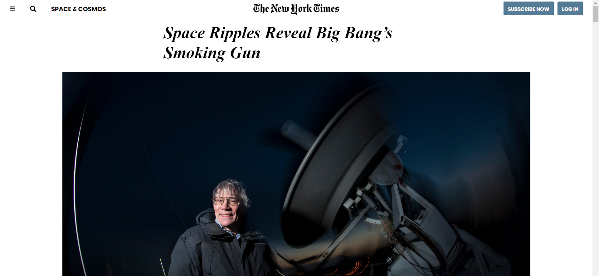

# PROJECT: POSITIONING AND FLOATING ELEMENTS
Hello! **I'm Alexander Nitiola** and this is my **PROJECT: POSITIONING AND FLOATING ELEMENTS** from the 
curriculum of The Odin Project's [curriculum.](https://www.theodinproject.com/courses?ref=homenav)

## Screenshot of My Work

## Notes
- Instructions: [PROJECT: POSITIONING AND FLOATING ELEMENTS](https://theodinproject.com/courses/html-and-css/lessons/positioning-and-floating-elements)
- Language:  
**HTML:  78.4%.  
CSS: 21.6%.**
- You can see my project through this link: [View in Browser](https://thecre8tor.github.io/nyt_website_clone/)  
**RESPONSIVE: 
Not Responsive**

- Click [here](https://www.nytimes.com/2014/03/18/science/space/detection-of-waves-in-space-buttresses-landmark-theory-of-big-bang.html?_r=0) to visit The New York Times original page.

## What i Learned
* I gained more experience on how to use CSS Flexbox & Advance Positioning.
* My CSS skill improved much more.
* I improved more on how to structure my HTML Document properly.

## I was able to build this website with:
* Flexbox
* CSS Advance Positioning